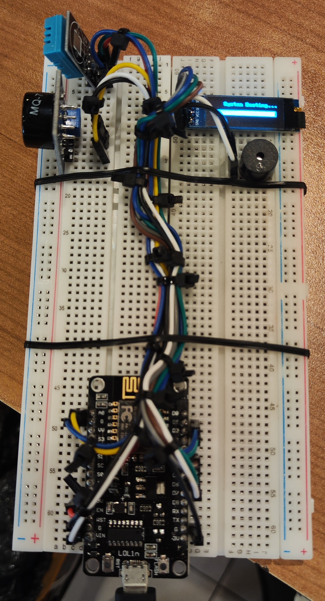

# Real-Time IoT Air Quality Monitoring System

<p align="center">
  
</p>

A comprehensive IoT solution developed as a university project for monitoring key air quality indicators in real-time. This system utilizes an ESP8266 microcontroller to capture data on Carbon Monoxide (CO), temperature, and humidity, providing both local alerts and remote data visualization through a web dashboard.

---

## ✨ Features

-   **Real-Time Monitoring**: Continuously measures CO concentration, ambient temperature, and relative humidity.
-   **Local Alerts**: An integrated OLED display provides instant on-device readings, while a buzzer triggers an audible alarm if temperature thresholds are exceeded.
-   **Remote Web Dashboard**: A user-friendly web interface displays live and historical data through intuitive charts and tables, accessible from any browser.
-   **Telegram Notifications**: Automatically sends alert messages to a designated Telegram chat when hazardous conditions are detected, enabling swift remote warnings.
-   **Cloud Integration**: Leverages AWS for robust backend data processing and hosting, ensuring high availability and scalability.

---

## 🏗️ System Architecture

The project is built on the standard Three-Layer IoT Architecture:

1.  **Perception Layer**: The physical layer consisting of the ESP8266 microcontroller, DHT11 (Temperature & Humidity) sensor, MQ-7 (Carbon Monoxide) sensor, an OLED display, and a buzzer.
2.  **Network Layer**: Utilizes the ESP8266's built-in Wi-Fi to send sensor data as JSON payloads to the backend via HTTP POST requests.
3.  **Application Layer**: A cloud-based backend built with **Python (Flask)** running on **AWS EC2** processes incoming data and stores it. The frontend is a **React** application that visualizes the data for the end-user.

---

## 🛠️ Tech Stack & Hardware

**Hardware Components:**
-   ESP8266 (NodeMCU) Microcontroller
-   MQ-7 Carbon Monoxide Sensor
-   DHT11 Temperature & Humidity Sensor
-   0.91" OLED Display (128x32)
-   Piezoelectric Buzzer
-   Breadboard and Jumper Wires

**Software & Cloud Services:**
-   **IoT Firmware**: Arduino IDE (C++)
-   **Backend**: Python, Flask
-   **Frontend**: JavaScript, React.js
-   **Cloud**: AWS EC2 (for backend hosting) & AWS S3 (for data storage and frontend hosting)
-   **Notifications**: Telegram Bot API

---

## 🚀 Getting Started: IoT Device Setup

This repository contains two primary firmware files for the ESP8266: one for calibration and one for main operation.

### Part 1: Calibrating the MQ-7 Sensor

A one-time calibration is **required** to establish the sensor's baseline resistance ($R_0$) in clean air.

1.  **Open the Calibration Code**: Load the `mq7_calibration.ino` file into your Arduino IDE.
2.  **Place the Sensor**: Put the MQ-7 sensor in a well-ventilated area with clean air (e.g., near an open window).
3.  **Upload the Sketch**: Upload the code to your ESP8266.
4.  **Monitor Calibration**: Open the Serial Monitor (baud rate `115200`). The device will first warm up for 3 minutes, then collect data for 5 minutes.
5.  **Get the R0 Value**: Once complete, the Serial Monitor will display the final calibrated `R0` value. **Copy this value.**

### Part 2: Main Monitoring Firmware

1.  **Open the Main Code**: Load the `main_airQuality_assg1.ino` file into your Arduino IDE.
2.  **Update Wi-Fi Credentials**: Change the `ssid` and `pass` variables to your Wi-Fi network's name and password.
    ```cpp
    char ssid[] = "YOUR_WIFI_NAME";
    char pass[] = "YOUR_WIFI_PASSWORD";
    ```
3.  **Update Calibrated R0 Value**: Find the `R0_CALIBRATED` constant and paste the value you obtained from the calibration step.
    ```cpp
    const float R0_CALIBRATED = 2.4599; // <-- PASTE YOUR VALUE HERE
    ```
4.  **Update Telegram Bot**: If you want to use your own Telegram bot, update the `BOT_TOKEN` and `CHAT_ID`.
5.  **Upload and Run**: Upload the sketch to your ESP8266. The device will boot up, connect to Wi-Fi, and begin sending data to the server.

---

## 📡 API Endpoints

The backend is hosted at `http://52.77.118.58`. The following endpoints are available for interacting with the system.

| Description | HTTP Method | Endpoint | Payload / Parameters |
| :--- | :--- | :--- | :--- |
| **Post Sensor Data** | `POST` | `/api/data` | **Body**: `{ "temperature": float, "humidity": float, "co": float }` |
| **Get Chart Data** | `GET` | `/api/data/chart` | **Query**: None. Returns the last 20 data points. |
| **Get Table Data** | `GET` | `/data/table` | **Query**: `?page=<int>&size=<int>` (e.g., `?page=1&size=20`) |

#### Example cURL Usage:
```bash
curl -X POST \
  -H "Content-Type: application/json" \
  -d '{"temperature": 25.5, "humidity": 60.2, "co": 15.7}' \
  [http://52.77.118.58/api/data](http://52.77.118.58/api/data)
```

---

## 👥 Contributors

This project was developed by Group 6, Class LCE1:
- Axel Nino Nakata (2702749701)
- Michael Matthew Muliawan (2702749834)
- Samantha Michelle (2702749752)
